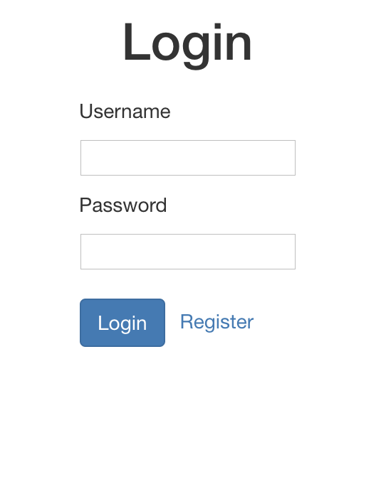
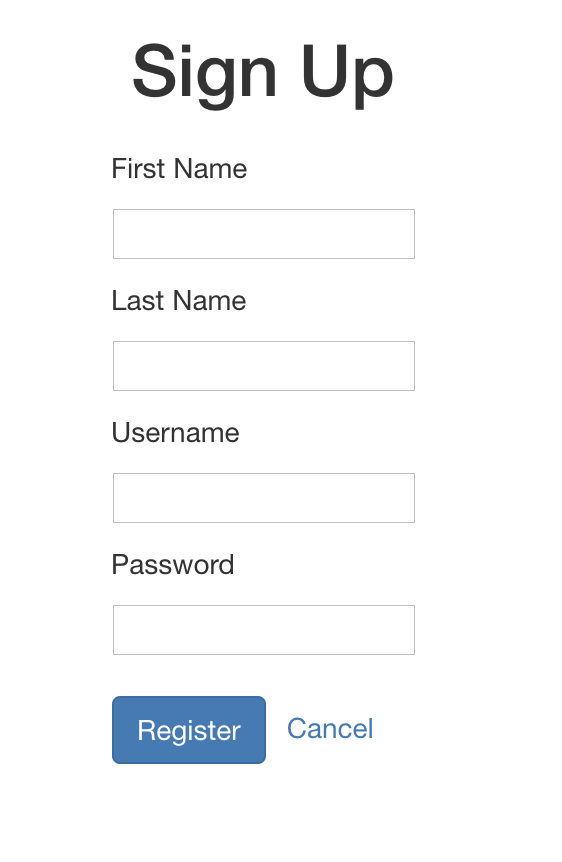

## Simple User Registration and Login functionality with React, NodeJs, ExpressJs and MongoDB

### Login Screen


### Sign up Screen


## UI

In the project directory, you can run:

### Quick Start
```javascript
// Install dependencies
npm install or yarn install

//start the client
npm start or yarn start
```
Runs the app in the development mode.<br>
Open [http://localhost:3000](http://localhost:3000) to view it in the browser.

The page will reload if you make edits.<br>
You will also see any lint errors in the console.


## API

Checkout to api directory then you can run:

### `nodemon server`

Runs the node server and page will reload if you make any edits

## Database

### `brew services start mongodb`

This will start the mongodb service

### `mongod --port 27018`

Runs mongod on 27018 port
